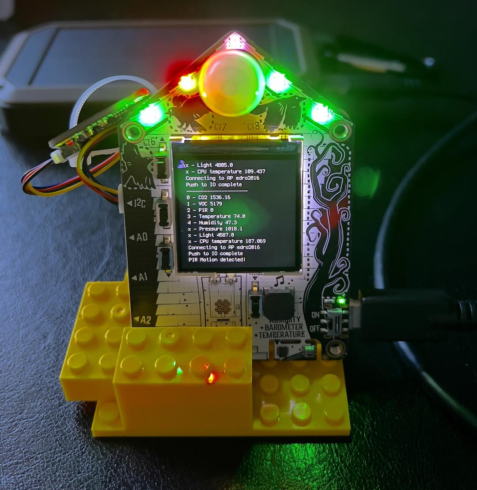

# Adafruit Funhouse Air Quality Monitor

# Version 0.1: 1/27/22

This Air Quality Monitor is built using the Adafruit Funhouse microcontroller, an add on PIR sensor, and an SGP30 carbon dioxide / VOC sensor. The code reads each of the sensors, adjusts them with predetermined calibration constants, prints the values to the Funhouse display, uploads them to Adafruit IO, and uses the dotstars to indicate status

## Prerequisites

### Hardware
- Adafruit FunHouse - WiFi Home Automation Development Board (https://www.adafruit.com/product/4985)
- Breadboard-friendly Mini PIR Motion Sensor with 3 Pin Header (https://www.adafruit.com/product/4871). This is optional - the program will run without this component and report no motion detected.
- SGP30 Air Quality Sensor Breakout - VOC and eCO2 - STEMMA QT / Qwiic (https://www.adafruit.com/product/3709). This is optional - the program will run without this component and bypass all co2 and voc measurements.
- Adafruit FunHouse Mounting Plate and Yellow Brick Stand (https://www.adafruit.com/product/4962). This is an optional way to stand up the Funhouse.

### Software

#### Setting up CircuitPython:
Follow the steps on Adafruit's page to install CircuitPython: https://learn.adafruit.com/adafruit-funhouse/circuitpython

#### Installing required CircuitPython libraries:
The libraries required for this project and their source / locations are:
Library | Source
---------|----------
adafruit_ahtx0.mpy | https://circuitpython.org/libraries
adafruit_bitmap_font | https://circuitpython.org/libraries
adafruit_bus_device |https://circuitpython.org/libraries
adafruit_display_text | https://circuitpython.org/librarie
adafruit_dotstar.mpy | https://circuitpython.org/libraries
adafruit_dps310.mpy | https://circuitpython.org/libraries
adafruit_fakerequests.mpy | https://circuitpython.org/libraries
adafruit_funhouse | https://circuitpython.org/libraries
adafruit_io | https://circuitpython.org/libraries
adafruit_minimqtt | https://circuitpython.org/libraries
adafruit_portalbase | https://circuitpython.org/libraries
adafruit_register | https://circuitpython.org/libraries
adafruit_requests.mpy | https://circuitpython.org/libraries
adafruit_sgp30.mpy | https://github.com/adafruit/Adafruit_CircuitPython_SGP30/releases
simpleio.mpy | https://circuitpython.org/libraries

#### Source Code
The source code (aqm_code.py) is available on github at: https://github.com/edro123/adafruit. Make sure you have CircuitPython installed and the required libraries copied to the /lib folder on the board.  Then rename "aqm_code.py" to "code.py" and copy it to the board.

#### Secrets file
You will need to edit the secrets.py file to input your information for wifi, Adafruit IO, and timezone. Copy the edited file to the board too.

#### Project bundle
You can install the source code and libraries as a bundle. Download funhouse_aqm_bundle.zip from TBD. unzip it and copy it to the device.

### Adafruit IO
To use Adafruit IO, you'll need to sign up for an account at https://io.adafruit.com. There are free and paid versions. This project will fit into free tier.

#### Feeds

Once you're signed up, create a set of feeds to match the feed names for each sensor (example image above and listed in the table below).

#### Dashboard

Once your feeds are set up, add them to a Dashboard (example image above). You can set up warning values to match the red-green-blue alerts in the code.

#### Factory reset:
The Adafruit Funhouse comes with an Arduino Self Test example pre-loaded. You can reload it by following the instructions at this link: https://learn.adafruit.com/adafruit-funhouse/factory-reset

## Operation:
### Initialization:
#### On startup, the code tests for an SGP30 board and will bypass all co2 and voc processing if it's not present

### Calibrate mode:
#### If you hold down the 'select' button on start up, the code will enter calibrate mode. In calibrate mode:
- All sensor values will be raw, not adjusted
- The software will not initialize the SGP30 baseline values. This will cause the device to start determining a new baseline. The software will read these values from the SGP30 and upload them to the IO text feed once per hour. At the end of the calibration period, you can update the software with the last values read from the SGP so that they can be restored on initialization. See this link: https://learn.adafruit.com/adafruit-sgp30-gas-tvoc-eco2-mox-sensor/arduino-code#baseline-set-and-get-2980166-20

### While running:

Sensor values are read, printed to the FunHouse TFT display, and posted to IO feeds. The dotstar LEDs are  used for status for a subset of the sensors. System messages are also sent to the text feed.

Sensor| Feed Name | LED | Blue | Green | Red
---------|----------|---------|---------|---------|---------
CO2 (sgp30) | c02 | 0 | <800 | between | >2500
TVOC (sgp30) | voc | 1 | <200 | between | >2500
PIR | pir | 2 | white only
temperature | temperature | 3 | <62 | between | >80
humidity | humidity | 4 |  <42 | between | >53
barometric pressure | pressure | n/a | n/a  | n/a | n/a 
light level | lightlevel | n/a | n/a | n/a  | n/a | n/a 
cpu temperature | cputemp | n/a | n/a | n/a  | n/a | n/a 
System messages | text | n/a | n/a  | n/a | n/a 

If in calibrate mode, raw sensor readings are recorded. If not in calibrate, the raw values are adjusted with a linear regression that must be developed offline to calibrate the readings to known references. The linear regression slope and intercept values used in the source code  will likely require revision for your specific HW. An example regression:

Note that the software should handle the following exceptions gracefully:
- WIFI errors
- Adafruit IO connection errors
- Missing SGP30 board
- Although it will handle some errors in the secrets.py file, it can't run if secrets.py is missing.

#### Controls
1. Use the slider control to vary brightness. Note: normal update mode reads the slider very slowly.

2. Hold the 'up' button to shift to fast mode:
- Forces IO update when pressed
- Sets brightness to 0.25
- Faster updates (loops 5x/second, IO updates 1/minute)

3. Hold the 'down' button to shift to normal mode:
- Forces an IO update when pressed
- Sets brightness to zero
- slower updates (loops 1/second, IO updates 1/10 minute)

4. Night light mode:
- The PIR motion sensor can trigger the LEDs to act as a night light.
- Only enabled if the display brightness is zero and the ambient light is low.
- Can be toggled while running with the 'select' button.

The Funhouse red led is on when code is running, off while sleeping

## Version:
0.1 - released 1/27/22

## Author: 
Ed Rosack - (https://github.com/edro123/)

## License

This project is licensed under the MIT License - see the [LICENSE.md](LICENSE.md) file for details

## Acknowledgments

* Many thanks to Adafruit for their documentation and sample code

## References
* Funhouse overview: https://learn.adafruit.com/adafruit-funhouse
* Guides for product: Adafruit FunHouse: https://learn.adafruit.com/products/4985/guides
* Funhouse Library: https://circuitpython.readthedocs.io/projects/funhouse/en/latest/
* Creating FunHouse Projects with CircuitPython: https://learn.adafruit.com/creating-funhouse-projects-with-circuitpython/code-examples
* Adafruit SGP30 Library: https://circuitpython.readthedocs.io/projects/sgp30/en/2.3.5/api.html
* Adafruit SGP30 TVOC/eCO2 Gas Sensor Overview: https://learn.adafruit.com/adafruit-sgp30-gas-tvoc-eco2-mox-sensor
* Sensirion SGP30 datasheet: https://sensirion.com/media/documents/984E0DD5/61644B8B/Sensirion_Gas_Sensors_Datasheet_SGP30.pdf
